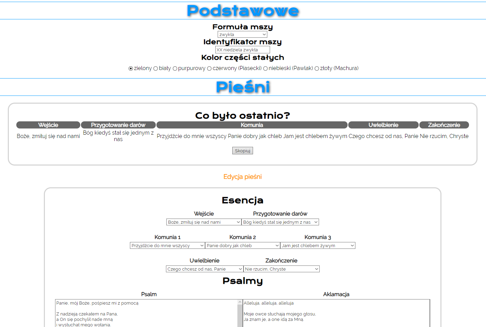
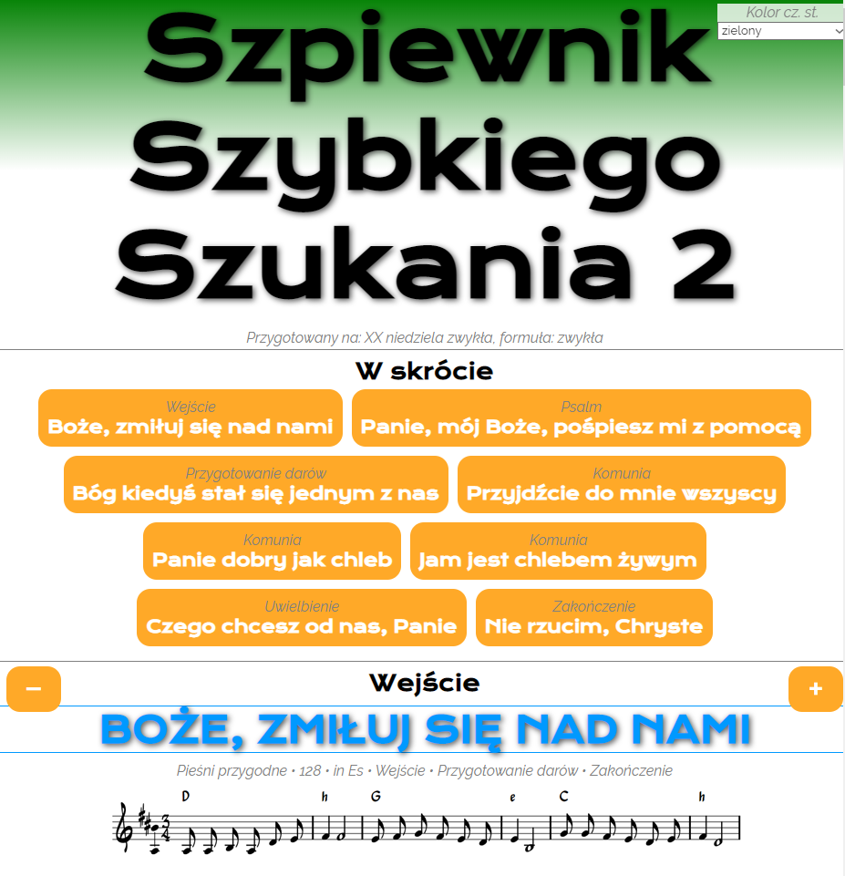
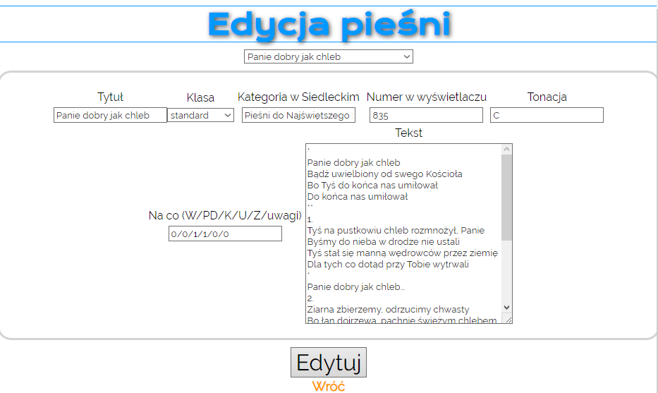

# What am I looking at?

This is a simple app for creating a "playlist" for a church organ player during service.

Using React and PHP.

## Screenshots

- Main view -- playlist editor

- Playlist

- Song editor

## Main files

- index.php -- a survey for creating the playlist
- out.php -- the actual playlist file; the target for index.php
- process.php -- works with index.php to create an offline-compatible HTML version of the playlist file
- betoniarka.php -- lit. cement mixer -- creates the database for JS insides

## Core

- db -- folder containing the database in a spreadsheet and CSV version
- songhistory.json -- info about the last saved playlist
- nuty -- charts for songs